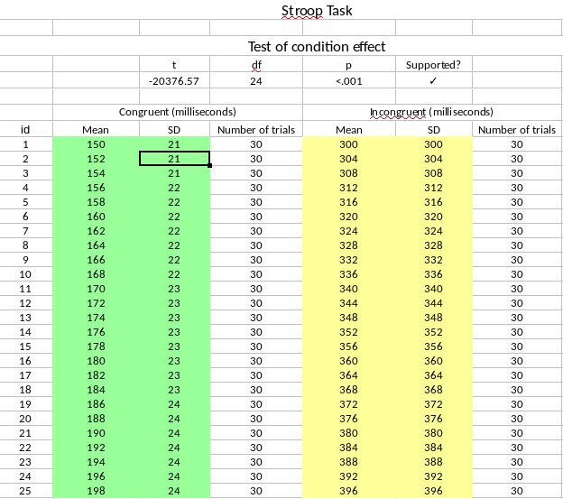

# Abstract

PLACEHOLDER

```{r, echo = FALSE}
fignr <- 1
tabnr <- 1

suppressPackageStartupMessages(if(!require(QCA)){install.packages('QCA', repos = 'http://cran.us.r-project.org')})
suppressPackageStartupMessages(library(QCA))

```

# Introduction

Cases of data fabrication in research often peak the interest of people in research and beyond, where many aim to understand why, what, or how data were fabricated. For reasons why researchers fabricate data, some look at systemic origins (i.e., the bad barrel argument), such as the highly competitive research system [@], whereas others look to personality traits that might be predictive of likelihood to commit misconduct [i.e., the bad-apple argument; @]. What was fabricated (i.e., which results) is often a question that drives scientific integrity committees established to investigate the case in order to correct the scientific record.

How data are fabricated often remains elusive, because of biased knowledge of cases and lack of first-hand information on data fabrication. Those data fabrication strategies that are most effective by avoiding detection are not available (i.e., discovery bias) for self-evident reasons: they avoid detection. Moreover, not only are the discovered cases highly selective, those that are discovered often do not result in confessions supplemented by explicit descriptions of the data fabrication strategies applied. For example, Diederik Stapel confessed to having fabricated data for over a decade and wrote a book about the process [@]. However, rarely does he describe how he fabricated data in sufficient detail to be of value for research on data fabrication strategies. Nonetheless, he is one of the few cases that includes some description, albeit just broad strokes. For example, the following is a small excerpt from his book [@;@]
<!-- (as copied from http://www.psychologicalscience.org/observer/derailed-the-rise-and-fall-of-diederik-stapel) -->

>I preferred to do it at home, late in the evening, when everyone was asleep. I made myself some tea, put my computer on the table, took my notes from my bag, and used my fountain pen to write down a neat list of research projects and effects I had to produce.… Subsequently I began to enter my own data, row for row, column for column ... 3, 4, 6, 7, 8, 4, 5, 3, 5, 6, 7, 8, 5, 4, 3, 3, 2. When I was finished, I would do the first analyses. Often, these would not immediately produce the right results. Back to the matrix and alter data. 4, 6, 7, 5, 4, 7, 8, 2, 4, 4, 6, 5, 6, 7, 8, 5, 4. Just as long until all analyses worked out as planned. (p. 167)

Moreover, when scientific integrity committees investigate for data fabrication, rarely will they be able to conclusively state _how_ data were fabricated. Some data fabrication strategies might be obvious if the raw data are available (e.g., copy-pasting responses), but others will be less obvious (e.g., multivariate modeling of the observed variables for the desired outcomes). Moreover, for many fabricated results there is multiplicity in how data can be fabricated to yield the resulting data set. That is, for each data fabrication strategy that yields the observed data set, there will be another data fabrication strategy that also yields that data set, but is substantively different. As such, second-hand information about data fabrication offers relatively little evidence on how data are actually fabricated by researchers, only options.

As such, we have no explicit and first-hand knowledge about how researchers fabricate data that is not afflicted by discovery bias. Data fabrication in a controlled environment, with all cases known, rarely occurs. As far as we know, there are only two studies that explicitly asked participants to fabricate research data [@10.1080/02664760601004940;@10.1080/08989629508573866;@10.1186/1471-2288-3-18], where only one of those specifically asked researchers to fabricate research data [@10.1186/1471-2288-3-18]. However, none of these studies subsequently asked participants to describe how they fabricated the data, leaving us none the wiser with respect to how data were in fact fabricated. 

<!-- Er mist nog 1 superbelangrijke alinea, nl over waarom het zo belangrijk is te weten hoe men data fabriceert.  -->
<!-- Ik zou dit in aparte alinea zetten en oppompen (pompen pompen!) – belang van weten HOE moet duidelijk zijn. Geef ook een voorbeeld of voorbeelden hoe dat dan kan helpen.
Ontwikkelen verschillende technieken te detecteren
 Proces van ontdekken, waarbij deze technieken kunnen worden toegepast; bijv, eerst kijken of er ruwe data is, dan naar of er stimulus materiaal voor handen is, dan naar of er missings zijn (zo niet, dan zegt dat wellicht iets over gebruik pc), dan iets over grootte effect size, etc.
Dit is verrekte lastig, mag ook op het eind gedaan worden! Ik bedoel, in discussie -->
Such qualitative information would provide a first-hand insight into how data are fabricated and provide fruitful avenues for the development of new statistical tools to detect data fabrication. 

In this report, we qualitatively assess the data fabrication strategies that actual researchers used to fabricate data in one of our previous studies [@]. Based on the transcripts of the interviews we conducted [@], we inductively try to assess the observed data fabrication strategies. Moreover, we combine the observed data fabrication strategies with results from various statistical tools to detect data fabrication, in order to assess whether certain data fabrication characteristics cause better or worse detection.

# Methods

## Data 

We reused 28 interview transcripts of researchers describing how they fabricated data in an experiment [@10.5281/zenodo.832491]. We previously asked these 28 researchers to fabricate raw data for a Stroop experiment [see Figure `r fignr`; @stroop1935], where they fabricated response times for 25 participants, such that there was a statistically significant effect between conditions (i.e., Stroop effect). In short, a Stroop experiment is typically a within-subjects experiment with two conditions: (1) congruent (e.g., the word 'red' is presented in red) and (2) incongruent (e.g., the word 'red' is presented in green). We asked these researchers to fabricate data for a Stroop effect in order to test whether we could separate fabricated data sets from genuine datasets [@] using statistical tools [@]. The transcripts of these 28 interviews are  available on Zenodo under a CC 0 license [@10.5281/zenodo.832491], permitting unrestricted reuse without the need for prior approval.

```{r spreadsheet-study2, fig.cap="Example of a filled in template spreadsheet used in the fabrication process. Respondents fabricated data in the yellow cells and green cells, which were used to compute the results of the hypothesis test of the condition effect. If the fabricated data confirm the hypotheses, a checkmark appeared. This template is available at [https://osf.io/2qrbs/](https://osf.io/2qrbs/).", out.width='100%', echo=FALSE}


fignr <- fignr + 1
```

<!-- Dit kan pas goed als de andere paper af is. -->

We also reused the results from five statistical methods to detect data fabrication, as the basis for the outcome measure of our Qualitative Comparative Analysis [QCA; @rihoux2008]. In our original study [@], we compared AANTAL methods to detect data fabrication across a set of 20 genuine data sets [retrieved from @] and 28 fabricated data sets. Five statistical methods proved effective in detecting data fabrication, including four different comparisons of multivariate relations and one comparing reported effect sizes. We used the results of these methods as the outcome measures for our Qualitative Comparative Analysis (QCA; more thoroughly explained below). More specifically, we computed the dichotomous outcome measure (i.e., data detected as fabricated or not) by specifying a decision criterion such that all data sets detected as fabricated were indeed fabricated (i.e., no  false positives).

<!-- Dit is te abstract om te kunnen volgen -->

For each of the 28 transcripts, we coded data fabrication characteristics that the first author inductively assessed. As such, the first author read through three transcripts to qualitatively assess various data fabrication characteristics available in the transcripts. Additionally, we coded characteristics of the fabricator's experience, which we include in the data set ([osf.io/xxxx](https://osf.io/xxxx)) for completeness but do not analyze considering these are not part of the data fabrication strategy per se.

<!-- Ok, ik snap het, maar kun je proberen iets minder vaag te maken hoe dit werkte? -->

This inductive approach reulted in five high-level data fabrication characteristics, as depicted in Table `r tabnr`. The first characteristic of data fabrication, taking preparatory measures, included various things researchers did to prepare for data fabrication, including things such as reading about statistical methods to detect data fabrication, reading about previous data fabrication cases, or discussing with others how to manipulate data. Second, using a random number generator (RNG) encompasses the use of simulations or adding noise to data. Third, using real Stroop data includes reusing data that are freely available online or from previous experiments. Fourth, duplicating or transforming data, includes behaviors such as copy-pasting rows of data or creating a score on another condition based on a simple transformation of the scores on the other condition, guaranteeing the presence of an effect. Finally, we considered the behavior of checking the data for detectability of being fabricated as the final characteristic of data fabrication.

<!-- Op zich een goed idee… maar twee dezelfde vectoren 10100 kunnen toch op een total verschillende manier data genereren. Persoonlijk zou ik het fijn vinden als dat snel dudielijk is

Meeer in het algemeen, en nog belangrijker, helpt het je te weten wleke van de 32 werd gebruikt, om het te detecteren? Maar goed, hier kom je later nog op terug, hoop ik.
 -->
<!-- dit intext? -->
```{r, echo = FALSE}
df <- data.frame(Characteristic = c('Preparatory measures',
                                    'Use Random Number Generator',
                                    'Use real Stroop data',
                                    'Duplicate/transform data',
                                    'Check data for detectability'))

knitr::kable(df, caption = "The five high-level data fabrication characteristics that can be combined to yield 32 different data fabrication strategies. More characteristics are possible, but due to the limited nature of QCA we restricted the number of characteristics to five.")

tabnr <- tabnr + 1
```

## Analysis

We used crisp set Qualitative Comparative Analysis [csQCA; @rihoux2008] to qualitatively analyze data fabrication strategies as determinants for whether or not data fabrication was detected using statistical methods. In csQCA, different patterns of case characteristics (i.e., data fabrication strategies; as specified in the previous paragraph) are used to qualitatively assess necessary and sufficient conditions for, in our case, detection of data fabrication (i.e., outcome measure). These patterns, or in our case data fabrication strategies, yield truth tables with outcomes per pattern. Table `r tabnr` depicts an example of a truth table in csQCA. A truth table has its origin from the field of logic and contains (for our purposes) only the presence or absence of various outcomes, that can subsequently be minimized to yield logic trees to determine the outcome. 

```{r, echo = FALSE}
data(LC)
LC <- LC[, -(1:2)]
names(LC) <- c(sprintf('char%s', 1:3), 'outcome')
ttLC <- truthTable(LC, "outcome")
ttLC$tt$OUT[2] <- 'C'
df <- ttLC$tt[,1:4]

knitr::kable(df, caption="Example of a truth table as used in crisp set Qualitative Comparative Analysis (csQCA). The outcome measure is the dependent variable, where the various patterns of the characteristics are used to determine under what conditions the outcome is observed. A `?` indicates that pattern was not observed and therefore the outcome is unknown; a `C` indicates that this pattern was observed >1, but that both outcomes occurred, creating a conflict in csQCA.")
```

The number of observable patterns is dependent on the number of characteristics available and increases exponentially ($2^k$, with $k$ being the number of characteristics). Hence, in the example with three characteristics, there are eight possible patterns. Consequently, some patterns are likely to remain unobserved if the number of cases is much less than the number of potential patterns (i.e., logical remainders; depicted as `?` in Table `r tabnr`). As such, we limited ourselves to five high-level characteristics of data fabrication strategies with 32 possible patterns, considering only 28 transcripts are available.

Another relevant aspect of truth tables, as depicted in Table `r tabnr` by `C`, is that of conflicting outcomes. Conflicting outcomes occur when one pattern occurs for two different cases, but yields different outcomes. For our case, that means that the same pattern results in both detection and non-detection of data fabrication. Typically, in csQCA, these cases are simply omitted in the analysis (conceptually comparable to listwise deletion) or omitted characteristics are inductively searched for that resolve the conflict [@rihoux2008]. We qualitatively investigate what might cause these conflicting outcomes and present results for both the original five characteristics and the potential additional characteristics in case of conflicting outcomes.

```{r, echo=FALSE}
tabnr <- tabnr + 1
```

We used the `R` package `QCA` [@r-core;@10.1016/j.jbusres.2007.01.002] for our QCA analysis (see [osf.io/XXXX]() for analysis script). More specifically, we used the outcomes of five different statistical methods to detect data fabrication [as presented in @], with the five characteristics mentioned in Table X as characteristics. We minimized the truth table using the enhanced Quine-McCluskey algorithm [@] for both detecting data as fabricated, and for fabricated data going undetected. As such, we initially conduct ten QCA's, with at most ten more in the case of conflicting outcomes in for all methods.

# Results

# Discussion

# Author's note

All materials used in this project are available at [https://github.com/chartgerink/2015ori-2](https://github.com/chartgerink/2015ori-2) and are preserved at Zenodo [@].

# References
